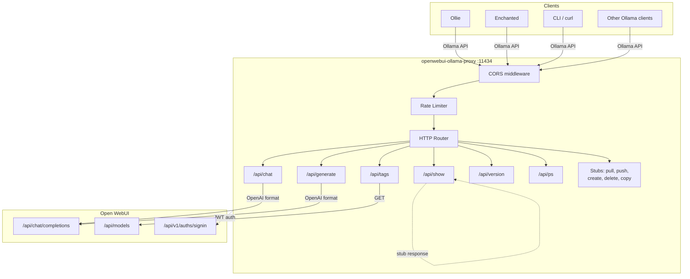
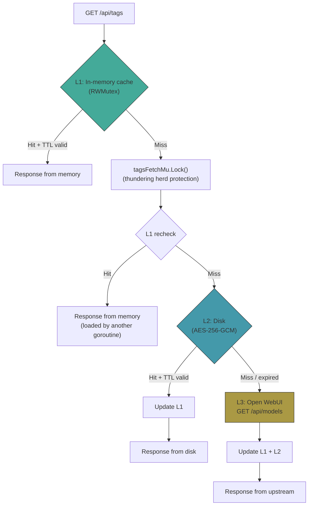
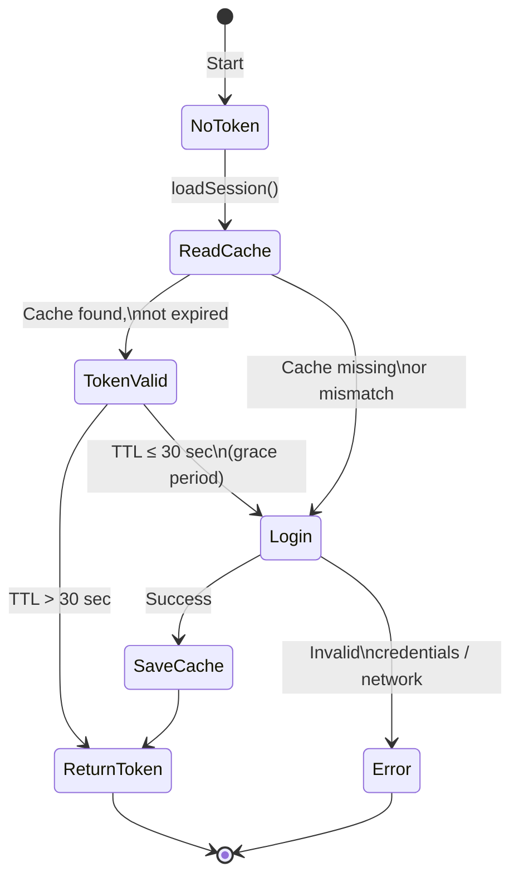
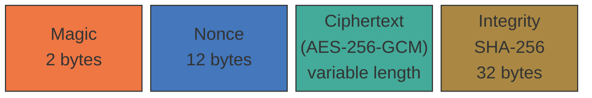
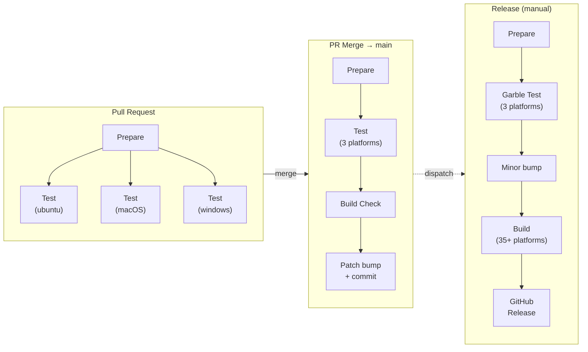

🇷🇺 [Русская версия](README.RU.md)

# openwebui-ollama-proxy

A proxy server that translates Ollama API calls into the OpenAI format and forwards them
to [Open WebUI](https://github.com/open-webui/open-webui). Allows native Ollama clients to work with models
hosted on Open WebUI without any client modification.

## Why

```
┌──────────────────────┐           ┌───────────────────────┐          ┌──────────────┐
│   Ollama clients     │  Ollama   │  openwebui-ollama-    │  OpenAI  │              │
│                      │   API     │       proxy           │   API    │  Open WebUI  │
│  Ollie, Enchanted,   ├──────────►│                       ├─────────►│              │
│  CLI, others...      │           │  Format translation   │          │  (upstream)  │
└──────────────────────┘           └───────────────────────┘          └──────────────┘
```

Open WebUI provides an OpenAI-compatible API, while many desktop and mobile clients only support the Ollama API.
This proxy bridges the compatibility gap — clients connect to the proxy as if it were a regular Ollama server,
and the proxy translates requests to Open WebUI.

## Features

- Streaming and non-streaming modes for `/api/chat` and `/api/generate`
- Multimodal support: images are forwarded as OpenAI content parts with automatic MIME type detection
- Three-tier model list cache: memory → disk → upstream
- Model metadata cache with configurable TTL
- AES-256-GCM encrypted disk cache with SHA-256 integrity check
- Automatic JWT token management with encrypted persistent session storage
- Rate limiting (token bucket)
- CORS with configurable origins
- Graceful shutdown on SIGINT / SIGTERM
- Zero external dependencies — Go stdlib only
- Cross-platform builds for 35+ targets

## Quick Start

### Install from release

Download the binary for your platform from the [releases page](../../releases).

### Build from source

```bash
git clone <repo-url>
cd openwebui-ollama-proxy
go generate ./...
go build -o openwebui-ollama-proxy ./
```

### Run

```bash
./openwebui-ollama-proxy \
  --openwebui-url https://your-openwebui.example.com \
  --email user@example.com \
  --password yourpassword
```

The proxy will start on `0.0.0.0:11434` (default Ollama port). Point your client to the proxy address
instead of the Ollama server.

## Architecture

### Overview



### `/api/chat` request flow


### Three-tier model cache (`/api/tags`)



### JWT session management



### Encrypted cache format



| Magic   | Data type      | File              |
|---------|----------------|-------------------|
| `CA 01` | Session (JWT)  | `session.bin`     |
| `CA 02` | Model list     | `tags.bin`        |
| `CA 03` | Model metadata | `show_<hash>.bin` |

The AES key is derived as `SHA-256(integrity_hash + commit_hash)`. The cache is automatically
invalidated on every new build.

### Format conversion


## Configuration

### Required flags

| Flag                  | Description           |
|-----------------------|-----------------------|
| `--openwebui-url URL` | Open WebUI server URL |
| `--email EMAIL`       | Email for auth        |
| `--password PASSWORD` | Password for auth     |

### Optional flags

| Flag                    | Default              | Description                                  |
|-------------------------|----------------------|----------------------------------------------|
| `--host`                | `0.0.0.0`            | Bind address                                 |
| `--port`                | `11434`              | Port (standard Ollama port)                  |
| `--cache-dir`           | `./cache`            | Cache file directory                         |
| `--tags-ttl`            | `10m`                | Model list cache TTL                         |
| `--show-ttl`            | `30m`                | Model metadata cache TTL                     |
| `--timeout`             | `30s`                | Non-streaming request timeout                |
| `--stream-idle-timeout` | `5m`                 | Stream idle timeout (0 = disabled)           |
| `--shutdown-timeout`    | `5s`                 | Graceful shutdown timeout                    |
| `--max-body`            | `104857600` (100 MB) | Maximum request body size                    |
| `--max-error-body`      | `1048576` (1 MB)     | Maximum upstream error body size             |
| `--cors-origins`        | `*`                  | CORS Allow-Origin (empty = disabled)         |
| `--rate-limit`          | `0`                  | Global request rate limit/sec (0 = disabled) |
| `--ollama-version`      | `0.5.4`              | Ollama API version reported to clients       |

### Informational flags

| Flag                | Description                                   |
|---------------------|-----------------------------------------------|
| `-i`                | Print build info (text) and exit              |
| `--info text\|json` | Print build info in specified format and exit |
| `-h`, `--help`      | Show flag help                                |

## API Endpoints

### Supported

| Endpoint        | Method    | Description                                 |
|-----------------|-----------|---------------------------------------------|
| `/`             | GET, HEAD | Health check. Returns `Ollama is running`   |
| `/api/version`  | GET       | Ollama API version (configurable)           |
| `/api/tags`     | GET       | Model list (three-tier cache)               |
| `/api/show`     | POST      | Model metadata (stub + cache)               |
| `/api/ps`       | GET       | Running models (empty list)                 |
| `/api/chat`     | POST      | Chat (streaming / non-streaming)            |
| `/api/generate` | POST      | Text generation (streaming / non-streaming) |

### Blocked (403 Forbidden)

| Endpoint      | Method | Reason                                    |
|---------------|--------|-------------------------------------------|
| `/api/pull`   | POST   | Model management via proxy is not allowed |
| `/api/push`   | POST   | —                                         |
| `/api/create` | POST   | —                                         |
| `/api/delete` | DELETE | —                                         |
| `/api/copy`   | POST   | —                                         |

### Not implemented (501 Not Implemented)

| Endpoint          | Method | Reason                   |
|-------------------|--------|--------------------------|
| `/api/embed`      | POST   | Embeddings not supported |
| `/api/embeddings` | POST   | —                        |

## Project Structure

```
openwebui-ollama-proxy/
├── main.go                  # Entry point, CLI arguments, graceful shutdown
├── server.go                # HTTP server, routing, CORS, rate limiter
├── handler_chat.go          # POST /api/chat (streaming + non-streaming)
├── handler_generate.go      # POST /api/generate (streaming + non-streaming)
├── handler_models.go        # GET /api/tags, POST /api/show, GET /api/ps
├── handler_stubs.go         # Stubs for blocked/unsupported endpoints
├── stream.go                # SSE parser (Open WebUI → NDJSON Ollama)
├── util.go                  # Helpers: JSON, format conversion, MIME
├── gen.go                   # go:generate directives
│
├── auth/
│   ├── auth.go              # JWT auth, auto-refresh, session persistence
│   └── auth_test.go
│
├── cache/
│   ├── cache.go             # AES-256-GCM encryption, Read[T]/Write[T] generics
│   ├── session.go           # Session cache (magic: CA 01)
│   ├── tags.go              # Model list cache (magic: CA 02)
│   ├── show.go              # Model metadata cache (magic: CA 03)
│   └── cache_test.go
│
├── ollama/
│   └── types.go             # Ollama API types
│
├── openai/
│   └── types.go             # OpenAI API types
│
├── target/
│   └── value_project.go     # Generated build constants (do not edit)
│
├── _run/                    # Build scripts and CI
│   ├── scripts/
│   │   ├── sys.sh           # Version management
│   │   ├── git.sh           # Git hooks
│   │   └── go_creator_const.sh  # target/value_project.go generation
│   └── values/
│       ├── name.txt         # Project name
│       └── ver.txt          # Current version
│
├── .github/
│   ├── workflows/
│   │   ├── tests.yml        # PR tests (3 platforms)
│   │   ├── pr-merge.yml     # Auto-bump patch on merge
│   │   └── release.yml      # Release: tests + build + GitHub Release
│   └── actions/             # Reusable CI actions
│
├── go.mod                   # Go module (no external dependencies)
├── CLAUDE.md                # Coding standards
└── LICENSE
```

## Usage Examples

### Basic run

```bash
./openwebui-ollama-proxy \
  --openwebui-url https://webui.example.com \
  --email admin@example.com \
  --password secret123
```

### Custom port with rate limiting

```bash
./openwebui-ollama-proxy \
  --openwebui-url https://webui.example.com \
  --email admin@example.com \
  --password secret123 \
  --port 8080 \
  --rate-limit 10 \
  --cors-origins "https://myapp.example.com"
```

### Aggressive caching

```bash
./openwebui-ollama-proxy \
  --openwebui-url https://webui.example.com \
  --email admin@example.com \
  --password secret123 \
  --tags-ttl 1h \
  --show-ttl 2h \
  --cache-dir /var/cache/ollama-proxy
```

### Testing chat via curl

```bash
# Non-streaming
curl http://localhost:11434/api/chat -d '{
  "model": "gpt-4o",
  "messages": [{"role": "user", "content": "Hello!"}],
  "stream": false
}'

# Streaming
curl http://localhost:11434/api/chat -d '{
  "model": "gpt-4o",
  "messages": [{"role": "user", "content": "Hello!"}]
}'

# With image
curl http://localhost:11434/api/chat -d '{
  "model": "gpt-4o",
  "messages": [{
    "role": "user",
    "content": "What is in this image?",
    "images": ["'$(base64 -w0 photo.jpg)'"]
  }],
  "stream": false
}'
```

### List models

```bash
curl http://localhost:11434/api/tags
```

### Build info

```bash
./openwebui-ollama-proxy -i
./openwebui-ollama-proxy --info json
```

## CI/CD



Tests run with the `-race` flag and include benchmarks. Release builds are obfuscated
via [garble](https://github.com/burrowers/garble).

## Supported Platforms

| OS      | Architectures                                                                                     |
|---------|---------------------------------------------------------------------------------------------------|
| Linux   | amd64, arm64, arm/v7, arm/v6, 386, mips, mipsle, mips64, mips64le, ppc64, ppc64le, riscv64, s390x |
| Windows | amd64, arm64, arm/v7, 386                                                                         |
| macOS   | amd64 (Intel), arm64 (Apple Silicon)                                                              |
| FreeBSD | amd64, arm64, arm/v6, arm/v7, 386                                                                 |
| OpenBSD | amd64, arm64, arm/v6, arm/v7, 386                                                                 |
| NetBSD  | amd64, arm64, arm/v6, arm/v7, 386                                                                 |
| Android | amd64, arm64, arm/v7, 386                                                                         |

## Compatible Clients

Any client that supports the Ollama API:

- [Ollie](https://github.com/nicepkg/ollie) (macOS)
- [Enchanted](https://github.com/AugustDev/enchanted) (iOS / macOS)
- [Ollama CLI](https://github.com/ollama/ollama)
- Any other client with a configurable Ollama endpoint

## Development

### Requirements

- Go 1.25+

### Running tests

```bash
go test -race -v ./...
```

### Benchmarks

```bash
go test -bench . -run=NONE -v ./...
```

### Code generation

```bash
go generate ./...
```

## License

See [LICENSE](LICENSE).
