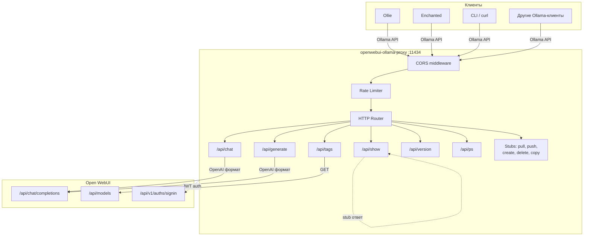
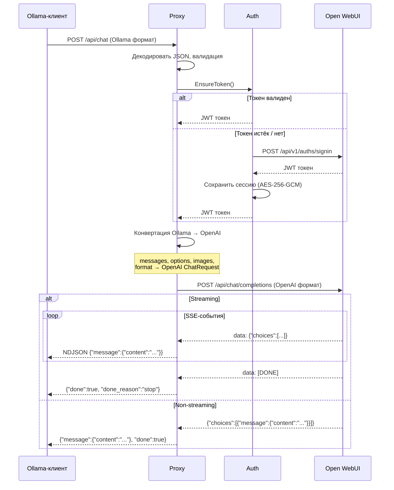
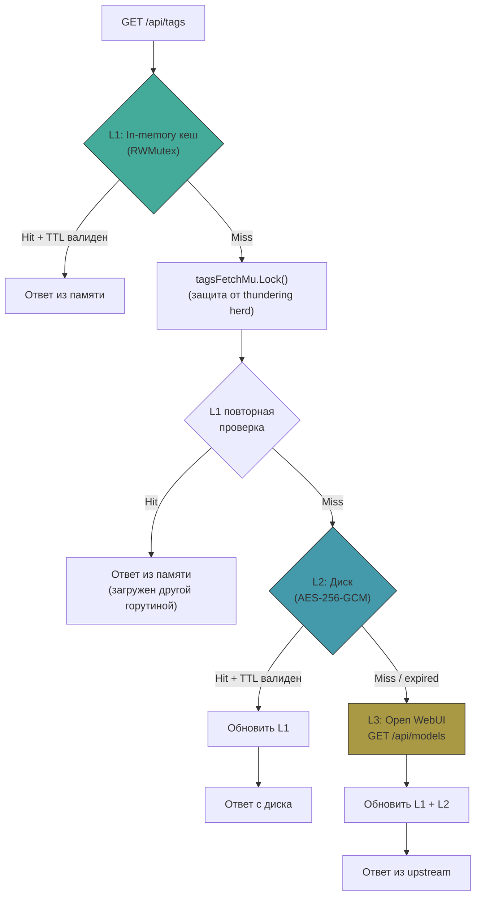
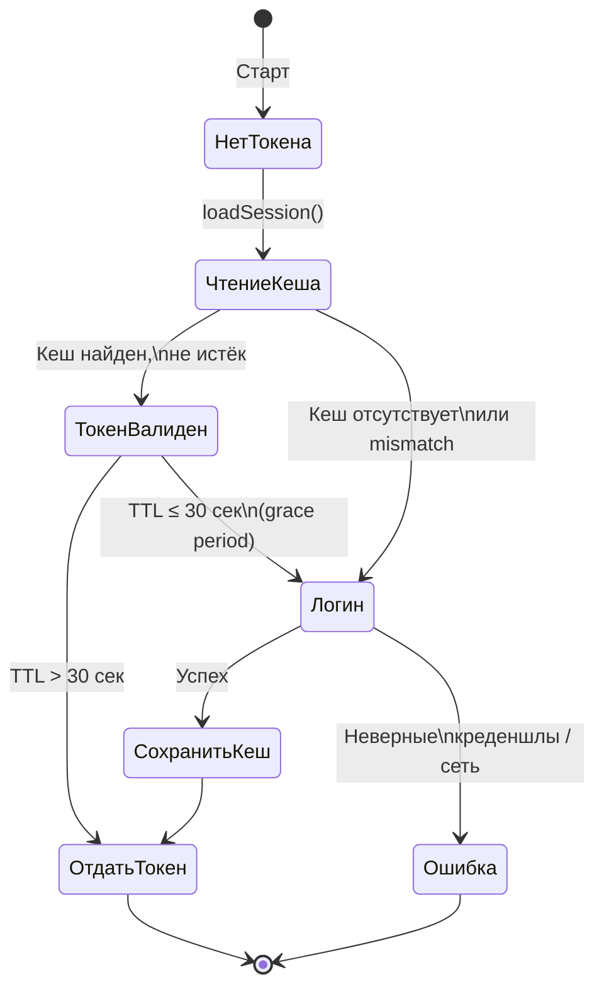
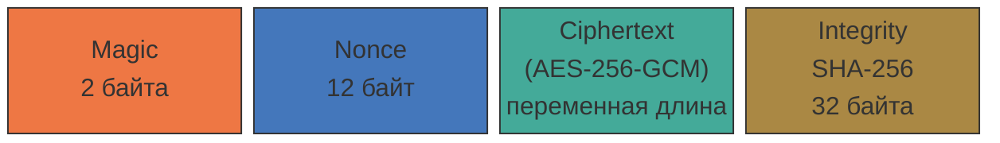
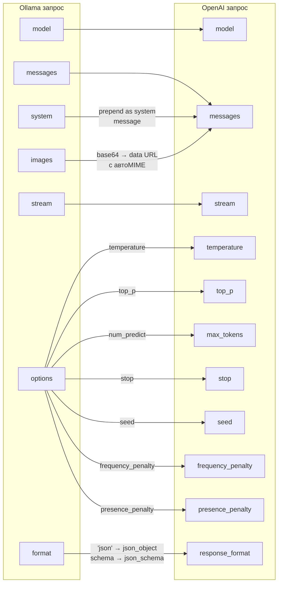

# openwebui-ollama-proxy

Прокси-сервер, который транслирует вызовы Ollama API в формат OpenAI и перенаправляет их
на [Open WebUI](https://github.com/open-webui/open-webui). Позволяет нативным Ollama-клиентам работать с моделями,
размещёнными на Open WebUI, без модификации клиентов.

## Зачем это нужно

```
┌──────────────────────┐           ┌───────────────────────┐          ┌──────────────┐
│   Ollama-клиенты     │  Ollama   │  openwebui-ollama-    │  OpenAI  │              │
│                      │   API     │       proxy           │   API    │  Open WebUI  │
│  Ollie, Enchanted,   ├──────────►│                       ├─────────►│              │
│  CLI, другие...      │           │  Трансляция форматов  │          │  (upstream)  │
└──────────────────────┘           └───────────────────────┘          └──────────────┘
```

Open WebUI предоставляет OpenAI-совместимый API, а многие десктопные и мобильные клиенты поддерживают только Ollama API.
Этот прокси решает проблему совместимости — клиенты подключаются к прокси как к обычному Ollama-серверу, а прокси
транслирует запросы на Open WebUI.

## Возможности

- Streaming и non-streaming режимы для `/api/chat` и `/api/generate`
- Мультимодальность: изображения пробрасываются как OpenAI content parts с автоопределением MIME-типа
- Трёхуровневый кеш списка моделей: память → диск → upstream
- Кеш метаданных моделей с настраиваемым TTL
- AES-256-GCM шифрование дискового кеша с SHA-256 integrity check
- Автоматическое управление JWT-токенами с зашифрованным persistent хранением сессии
- Rate limiting (token bucket)
- CORS с настраиваемыми origins
- Graceful shutdown по SIGINT / SIGTERM
- Нулевые внешние зависимости — только Go stdlib
- Кросс-платформенная сборка на 35+ целей

## Быстрый старт

### Установка из релиза

Скачать бинарник для вашей платформы со [страницы релизов](../../releases).

### Сборка из исходников

```bash
git clone <repo-url>
cd openwebui-ollama-proxy
go generate ./...
go build -o openwebui-ollama-proxy ./
```

### Запуск

```bash
./openwebui-ollama-proxy \
  --openwebui-url https://your-openwebui.example.com \
  --email user@example.com \
  --password yourpassword
```

Прокси запустится на `0.0.0.0:11434` (стандартный порт Ollama). В клиенте укажите адрес прокси вместо адреса
Ollama-сервера.

## Архитектура

### Общая схема работы



### Обработка запроса `/api/chat`



### Трёхуровневый кеш моделей (`/api/tags`)



### Управление JWT-сессией



### Формат зашифрованного кеша



| Magic   | Тип данных        | Файл              |
|---------|-------------------|-------------------|
| `CA 01` | Сессия (JWT)      | `session.bin`     |
| `CA 02` | Список моделей    | `tags.bin`        |
| `CA 03` | Метаданные модели | `show_<hash>.bin` |

Ключ AES выводится как `SHA-256(integrity_hash + commit_hash)`. При каждой новой сборке кеш инвалидируется
автоматически.

### Конвертация форматов



## Конфигурация

### Обязательные параметры

| Флаг                  | Описание               |
|-----------------------|------------------------|
| `--openwebui-url URL` | URL сервера Open WebUI |
| `--email EMAIL`       | Email для авторизации  |
| `--password PASSWORD` | Пароль для авторизации |

### Дополнительные параметры

| Флаг                    | По умолчанию         | Описание                                     |
|-------------------------|----------------------|----------------------------------------------|
| `--host`                | `0.0.0.0`            | Адрес привязки                               |
| `--port`                | `11434`              | Порт (стандартный для Ollama)                |
| `--cache-dir`           | `./cache`            | Директория для кеш-файлов                    |
| `--tags-ttl`            | `10m`                | TTL кеша списка моделей                      |
| `--show-ttl`            | `30m`                | TTL кеша метаданных модели                   |
| `--timeout`             | `30s`                | Таймаут для non-streaming запросов           |
| `--stream-idle-timeout` | `5m`                 | Таймаут бездействия стрима (0 = отключён)    |
| `--shutdown-timeout`    | `5s`                 | Таймаут graceful shutdown                    |
| `--max-body`            | `104857600` (100 МБ) | Максимальный размер тела запроса             |
| `--max-error-body`      | `1048576` (1 МБ)     | Максимальный размер тела ошибки upstream     |
| `--cors-origins`        | `*`                  | CORS Allow-Origin (пусто = отключён)         |
| `--rate-limit`          | `0`                  | Глобальный лимит запросов/сек (0 = отключён) |
| `--ollama-version`      | `0.5.4`              | Версия Ollama API для клиентов               |

### Информационные флаги

| Флаг                | Описание                                      |
|---------------------|-----------------------------------------------|
| `-i`                | Вывести информацию о сборке (текст) и выйти   |
| `--info text\|json` | Вывести информацию о сборке в формате и выйти |
| `-h`, `--help`      | Справка по флагам                             |

## API-эндпоинты

### Поддерживаемые

| Эндпоинт        | Метод     | Описание                                     |
|-----------------|-----------|----------------------------------------------|
| `/`             | GET, HEAD | Health check. Возвращает `Ollama is running` |
| `/api/version`  | GET       | Версия Ollama API (настраиваемая)            |
| `/api/tags`     | GET       | Список моделей (трёхуровневый кеш)           |
| `/api/show`     | POST      | Метаданные модели (stub + кеш)               |
| `/api/ps`       | GET       | Запущенные модели (пустой список)            |
| `/api/chat`     | POST      | Чат (streaming / non-streaming)              |
| `/api/generate` | POST      | Генерация текста (streaming / non-streaming) |

### Заблокированные (403 Forbidden)

| Эндпоинт      | Метод  | Причина                                    |
|---------------|--------|--------------------------------------------|
| `/api/pull`   | POST   | Управление моделями через прокси запрещено |
| `/api/push`   | POST   | —                                          |
| `/api/create` | POST   | —                                          |
| `/api/delete` | DELETE | —                                          |
| `/api/copy`   | POST   | —                                          |

### Не реализованные (501 Not Implemented)

| Эндпоинт          | Метод | Причина                      |
|-------------------|-------|------------------------------|
| `/api/embed`      | POST  | Embeddings не поддерживаются |
| `/api/embeddings` | POST  | —                            |

## Структура проекта

```
openwebui-ollama-proxy/
├── main.go                  # Точка входа, CLI-аргументы, graceful shutdown
├── server.go                # HTTP-сервер, роутинг, CORS, rate limiter
├── handler_chat.go          # POST /api/chat (streaming + non-streaming)
├── handler_generate.go      # POST /api/generate (streaming + non-streaming)
├── handler_models.go        # GET /api/tags, POST /api/show, GET /api/ps
├── handler_stubs.go         # Заглушки для запрещённых/неподдерживаемых эндпоинтов
├── stream.go                # SSE-парсер (Open WebUI → NDJSON Ollama)
├── util.go                  # Хелперы: JSON, конвертация форматов, MIME
├── gen.go                   # go:generate директивы
│
├── auth/
│   ├── auth.go              # JWT-авторизация, auto-refresh, session persistence
│   └── auth_test.go
│
├── cache/
│   ├── cache.go             # AES-256-GCM шифрование, Read[T]/Write[T] generics
│   ├── session.go           # Кеш сессии (magic: CA 01)
│   ├── tags.go              # Кеш списка моделей (magic: CA 02)
│   ├── show.go              # Кеш метаданных модели (magic: CA 03)
│   └── cache_test.go
│
├── ollama/
│   └── types.go             # Типы данных Ollama API
│
├── openai/
│   └── types.go             # Типы данных OpenAI API
│
├── target/
│   └── value_project.go     # Генерируемые константы сборки (не редактировать)
│
├── _run/                    # Скрипты сборки и CI
│   ├── scripts/
│   │   ├── sys.sh           # Управление версиями
│   │   ├── git.sh           # Git-хуки
│   │   └── go_creator_const.sh  # Генерация target/value_project.go
│   └── values/
│       ├── name.txt         # Имя проекта
│       └── ver.txt          # Текущая версия
│
├── .github/
│   ├── workflows/
│   │   ├── tests.yml        # Тесты на PR (3 платформы)
│   │   ├── pr-merge.yml     # Auto-bump patch при merge
│   │   └── release.yml      # Релиз: тесты + сборка + GitHub Release
│   └── actions/             # Переиспользуемые CI-экшены
│
├── go.mod                   # Go-модуль (без внешних зависимостей)
├── CLAUDE.md                # Стандарты кодирования
└── LICENSE
```

## Примеры использования

### Базовый запуск

```bash
./openwebui-ollama-proxy \
  --openwebui-url https://webui.example.com \
  --email admin@example.com \
  --password secret123
```

### С кастомным портом и rate limiting

```bash
./openwebui-ollama-proxy \
  --openwebui-url https://webui.example.com \
  --email admin@example.com \
  --password secret123 \
  --port 8080 \
  --rate-limit 10 \
  --cors-origins "https://myapp.example.com"
```

### С агрессивным кешированием

```bash
./openwebui-ollama-proxy \
  --openwebui-url https://webui.example.com \
  --email admin@example.com \
  --password secret123 \
  --tags-ttl 1h \
  --show-ttl 2h \
  --cache-dir /var/cache/ollama-proxy
```

### Проверка chat через curl

```bash
# Non-streaming
curl http://localhost:11434/api/chat -d '{
  "model": "gpt-4o",
  "messages": [{"role": "user", "content": "Hello!"}],
  "stream": false
}'

# Streaming
curl http://localhost:11434/api/chat -d '{
  "model": "gpt-4o",
  "messages": [{"role": "user", "content": "Hello!"}]
}'

# С изображением
curl http://localhost:11434/api/chat -d '{
  "model": "gpt-4o",
  "messages": [{
    "role": "user",
    "content": "What is in this image?",
    "images": ["'$(base64 -w0 photo.jpg)'"]
  }],
  "stream": false
}'
```

### Список моделей

```bash
curl http://localhost:11434/api/tags
```

### Информация о сборке

```bash
./openwebui-ollama-proxy -i
./openwebui-ollama-proxy --info json
```

## CI/CD


Тесты запускаются с `-race` флагом и включают бенчмарки. Релизные сборки обфусцируются
через [garble](https://github.com/burrowers/garble).

## Поддерживаемые платформы

| ОС      | Архитектуры                                                                                       |
|---------|---------------------------------------------------------------------------------------------------|
| Linux   | amd64, arm64, arm/v7, arm/v6, 386, mips, mipsle, mips64, mips64le, ppc64, ppc64le, riscv64, s390x |
| Windows | amd64, arm64, arm/v7, 386                                                                         |
| macOS   | amd64 (Intel), arm64 (Apple Silicon)                                                              |
| FreeBSD | amd64, arm64, arm/v6, arm/v7, 386                                                                 |
| OpenBSD | amd64, arm64, arm/v6, arm/v7, 386                                                                 |
| NetBSD  | amd64, arm64, arm/v6, arm/v7, 386                                                                 |
| Android | amd64, arm64, arm/v7, 386                                                                         |

## Совместимые клиенты

Любой клиент, поддерживающий Ollama API:

- [Ollie](https://github.com/nicepkg/ollie) (macOS)
- [Enchanted](https://github.com/AugustDev/enchanted) (iOS / macOS)
- [Ollama CLI](https://github.com/ollama/ollama)
- Любые другие клиенты с настраиваемым Ollama endpoint

## Разработка

### Требования

- Go 1.25+

### Запуск тестов

```bash
go test -race -v ./...
```

### Бенчмарки

```bash
go test -bench . -run=NONE -v ./...
```

### Генерация кода

```bash
go generate ./...
```

## Лицензия

См. файл [LICENSE](LICENSE).
